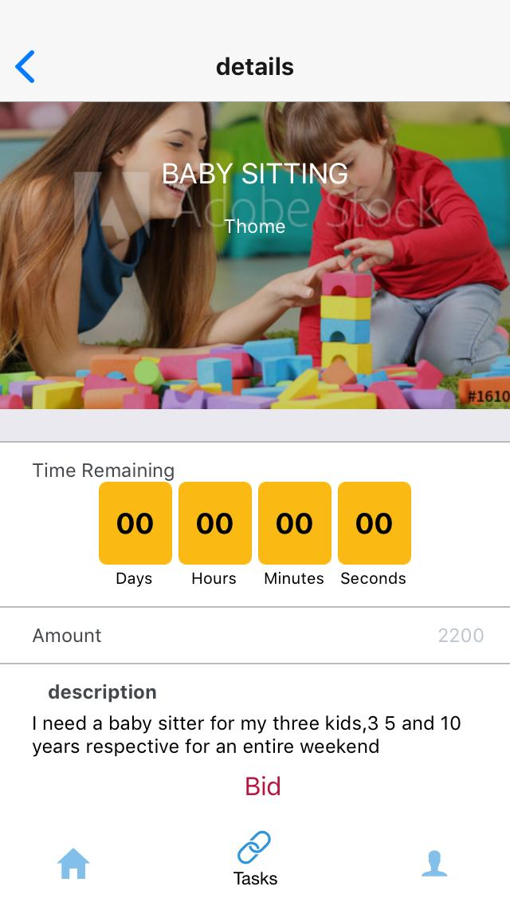

\# gawatask Application

This is a mobile app, intended to link people who require common house hold
chores done

with people who are willing to take up the task at a fee.

It is currently under development and uses react-native as the development
language for the Client side app

and PHP as the development language for the server side.

Login

During login you are required to sign in as either a service worker (Freelancer)
or a client

**CLIENT: (** This is for those who need certain tasks done for them**)**

**Homescreen: Client**

A Client post a job

The client can view the job they posted in the Task history section

Check out the calendar for schedule

**Client** can view all freelancers available and book them

**Client Profile**

Client can view count of posted jobs

**FREELANCER (**People willing to carry out the given task **)**

**Homescreen**

**Taskscreen**

Freelancer can view posted jobs and be able to search through the list

They can view more details pertaining the given job and bid for it

**Freelancer Profile**

